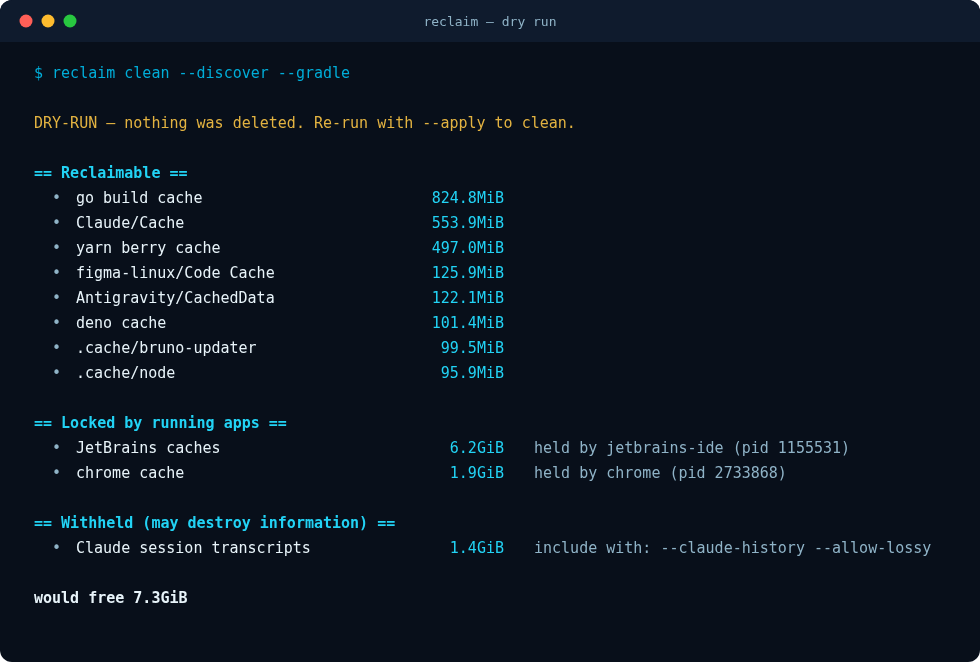

<div align="center">


# reclaim

**Reclaim disk space without losing anything you cannot get back.**

[](https://go.dev/)
[](#status)
[](go.mod)
[](#development)
[](LICENSE)

</div>

## What it is

Every disk-cleanup tool faces the same question and most answer it badly: *what is
safe to delete?* Treat everything cache-shaped as disposable and you eventually
remove a browser's `Local Storage` and log someone out of everything, or delete a
dependency tree whose lockfile no longer resolves. Be too timid and the tool is
not worth running.

`reclaim` answers it by refusing to treat "regenerable" as one category. Every
target is a **unit** carrying a tier — from *costs nothing* to *may be
irreplaceable* — and a separate flag saying whether losing it destroys
information or merely costs a re-download. The planner walks tiers in order,
stops at a ceiling, and **an opt-in flag can raise that ceiling but can never
authorise destroying information**. Only `--allow-lossy` does that.

The second thing it takes seriously is that caches belong to programs that may be
running right now. Deleting a live IDE's cache corrupts the session it is in the
middle of. So before anything is selected, `reclaim` reads the process table and
parks every unit whose directories belong to something currently running, then
tells you what to quit and which pid to blame.

```console
$ reclaim clean
DRY-RUN — nothing was deleted. Re-run with --apply to clean.
...
== Locked by running apps ==
  • JetBrains caches    6.2GiB  held by jetbrains-ide (pid 1155531)
      quit it, then re-run
```

Nothing is deleted without `--apply`, and `--apply` prompts before it acts.

## Install

```bash
go install github.com/mralaminahamed/reclaim/cmd/reclaim@latest
```

Or build from a checkout:

```bash
go build -o reclaim ./cmd/reclaim
```

There are no third-party dependencies. For a tool that deletes files as root, an
empty `require` block is a feature rather than an accident.

## Usage

<div align="center">

</div>

```bash
reclaim clean               # measure and report; deletes nothing
reclaim clean --apply       # reclaim, after confirming
reclaim status              # filesystems, free space, pressure
reclaim analyze --min 1G    # largest directories; advisory, never deleted
reclaim history             # what past runs actually removed
```

### Targets

```bash
reclaim clean --free 12G    # clean until 12G is free, then stop
reclaim clean --auto        # read disk pressure and pick a target
reclaim clean --tier 2      # never escalate past tier 2
```

`--auto` finds the most pressured filesystem and lets how full it is decide how
hard to try. A comfortable disk gets only the free tiers; a critical one earns a
cold reload.

### Scope

```bash
reclaim clean --discover               # also claim caches with no hardcoded rule
reclaim clean --only 'xdg-*'           # restrict to matching unit ids
reclaim clean --exclude 'npm-*'        # drop matching unit ids
reclaim clean --workers 12             # size the probe pool
reclaim clean --json                   # machine-readable output
```

### Opt-in groups

Units in these groups are **never** touched unless you name them:

| Flag | Reclaims |
|---|---|
| `--gradle` | `~/.gradle/caches`, `~/.gradle/wrapper` |
| `--maven` | `~/.m2/repository` |
| `--jetbrains` | JetBrains IDE caches |
| `--browsers` | Chrome, Brave and Firefox HTTP caches |
| `--playwright` | Playwright browser binaries |
| `--system` | apt cache, bounded journal vacuum, superseded snap revisions |
| `--claude-jobs`, `--claude-plugins` | Claude Code scratch and plugin cache |
| `--docker`, `--docker-volumes` | Docker prune — volumes may hold databases |
| `--sites-idle N` | dependency trees of projects idle for N days |

Irreversible units additionally require `--allow-lossy`. Set `RECLAIM_NO_OPLOG=1`
to disable the operations log.

`--system` needs root. `reclaim` asks for it once, up front, via `sudo -v` — so
you get a single password prompt rather than one per unit — and if elevation is
declined the system units are reported under **Failed** with the reason, never
counted as reclaimed.

## Safety model

- **Dry run by default.** Nothing is deleted and no command runs without
  `--apply`, which prompts unless given `--yes`.
- **Tiers.** Units run cheapest-first and the planner will not cross its ceiling.
- **Reversibility is absolute.** An opt-in flag authorises a unit but never
  authorises destroying information. A test pins that distinction.
- **Opt-in means opt-in.** A unit carrying a flag runs only when that flag is
  passed, whatever the tier ceiling says.
- **Locks.** Caches of running applications are skipped, named, and attributed to
  a pid. `reclaim` excludes its own process, so its command line cannot lock it
  out of its own work.
- **Probing never deletes.** Everything reachable from the measuring phase is
  read-only, asserted by a test that walks the tree before and after.
- **Protected names.** `Local Storage`, `IndexedDB`, `Cookies`, `Login Data` and
  friends are never treated as caches, in any casing.
- **Protected paths.** A backstop refuses `/`, top-level system directories and
  `$HOME` however a unit is defined, so a malformed unit cannot aim the deleter
  at the wrong tree.

## How it works

```
survey → catalog → probe → lock → plan → run → report
```

The catalog registers a unit only when its path exists or its tool is installed.
Probing is `du`-bound and every unit is independent, so it runs on a worker pool —
a full discovery run over a developer machine takes about **1.7 seconds**.
Locking happens *after* probing, so a locked unit still reports its size and you
can see what quitting the app would buy you.

```
cmd/reclaim/         the CLI
internal/unit/       unit model and registry
internal/catalog/    the table of things worth reclaiming
internal/system/     apt, journal and snap units
internal/scan/       dependency trees of idle projects
internal/probe/      parallel measurement
internal/lock/       running-application detection
internal/plan/       tier ceiling and selection
internal/runner/     execution, with a protected-path backstop
internal/discover/   caches with no hardcoded rule
internal/report/     text and JSON output
internal/oplog/      append-only record of what was deleted
internal/fsutil/     sizes, mounts and pressure
```

Discovery uses two different rules on purpose. Everything directly under
`~/.cache` is regenerable by the XDG basedir spec, so it is claimed by *location*
and needs no whitelist. A cache nested inside `~/.config` sits beside real
application state, so there it is claimed by *name* against a strict list.

## Development

```bash
go test ./...          # 99 tests across 13 packages
go test ./... -race
go vet ./...
```

The CLI tests build the real binary and run it against a fixture `HOME`, so flag
parsing, exit codes, dry-run behaviour and JSON validity are covered end to end.

Assets are generated, never hand-edited — editing them individually is what let
the palette drift the first time:

```bash
python3 assets/generate.py && bash assets/render.sh
```

## Status

Linux only today. macOS support is planned and tracked in
[#1](https://github.com/mralaminahamed/reclaim/issues/1).

Note that `GOOS=darwin go build` currently *succeeds*, which is misleading: the
process table reader returns nothing on macOS, so every unit would look unlocked.
That is [#2](https://github.com/mralaminahamed/reclaim/issues/2) and it blocks
everything else — it is a safety regression, not a missing feature.

This began as a single self-contained bash script that reached 1615 lines and 201
built-in assertions. It is preserved in git history:

```bash
git show 67fd60c:reclaim.sh > reclaim.sh
```

## License

MIT — see [LICENSE](LICENSE).
